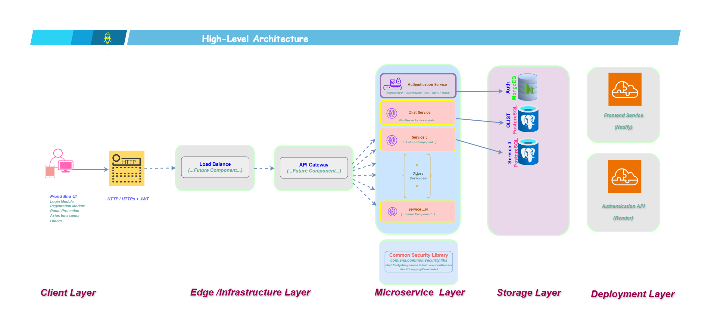
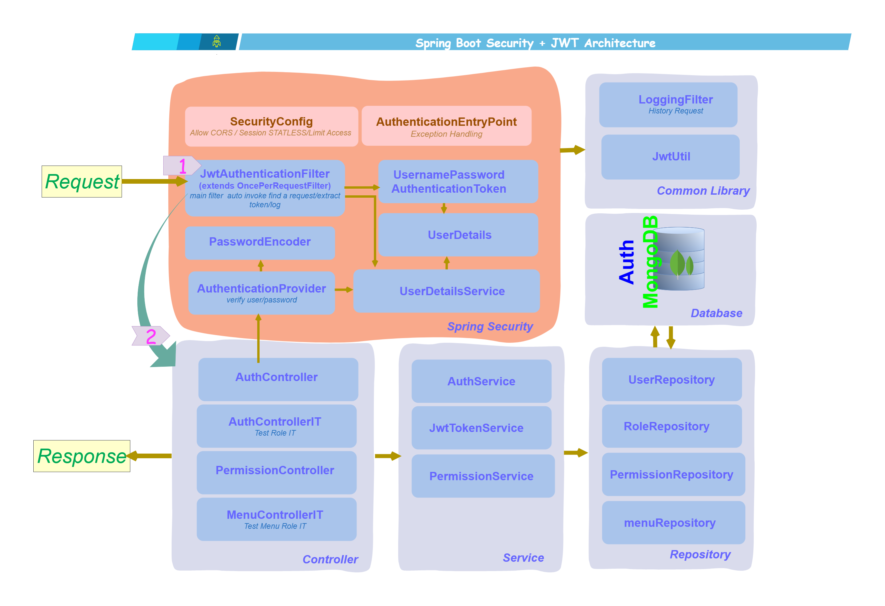
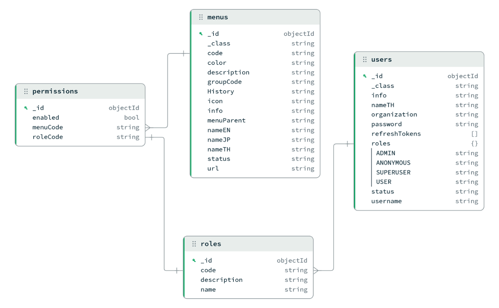
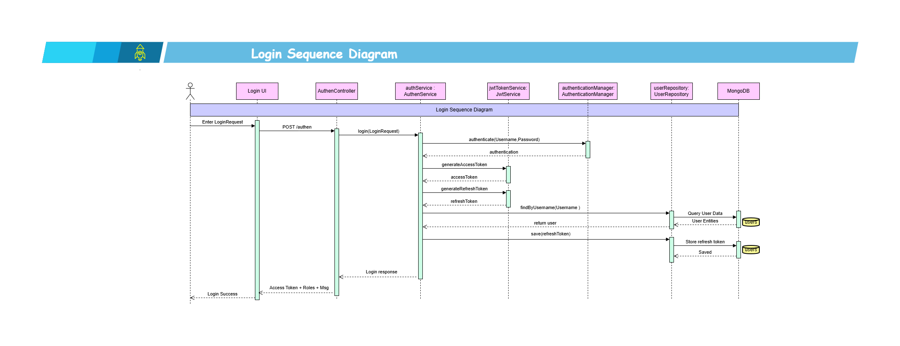
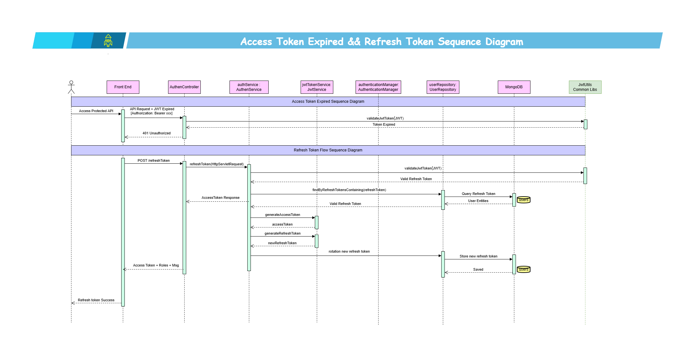

# JWT Authentication (Spring Boot) with MongoDB
 

[//]: # ( > 🚧 This project is currently in progress.)

## 📌 Overview
This project is part of my learning journey, where I explore how to design and build backend systems step by step using Spring Boot and JWT authentication.
I created this repository as a hands-on learning space for experimentation, practice, and continuous improvement. The goal is to understand real-world authentication flows and apply best practices in backend development.

## 🏗 Diagrams

The system is designed with a microservice-ready architecture.
This section provides an overview of the system architecture, authentication flow, authorization process, and database design.
### 📐 High-Level Architecture
Illustrates the overall system architecture, deployment environment, microservices, shared libraries, and databases.

### 📐 Spring Boot Security + JWT Architecture
Provides a visual overview of how Spring Security and JWT authentication work together to secure a Spring Boot REST API.

### 🗄 Database Design (ER Diagram)
Illustrates relationships among Users, Roles, Permissions, Menus, Organizations, and Refresh Tokens.

### 🔐 Authentication Flow
Shows the login process using Spring Security, JWT authentication, and Refresh Token generation.

### 🛡 Authorization Flow and Refresh Token Flow
Demonstrates JWT validation, Spring Security filter chain, and protected API access. 

[//]: # (### 👥 RBAC & Dynamic Menu Authorization)

[//]: # (Shows how menus are dynamically generated based on user roles and permissions.)

[//]: # ()
[//]: # (![RBAC Menu Flow]&#40;docs/images/rbac-menu-flow.png&#41;)
 

 

 ## 📦 Common Libraries

This project integrates a shared library to centralize reusable components and ensure consistency across services.

### 🔧 Features
- JWT authentication utilities  
- Global exception handling  
- Centralized logging configuration  

### 🔗 Repository
👉 
<a href="https://github.com/Thiraporn/common-libs"> Common Libs</a>

## 🛠 Tech Stack
- Java 17
- Spring Boot 3
- Spring Security + JWT (RS256)
- MongoDB
- JUnit 5 + Mockito
- Maven 
- REST API
- Integration Testing
- Git/GitHub
- Postman
- Render (Free-tier Deployment)

## 🧩  Features
### 🔐 Authentication & Security
 - JWT Authentication (Access Token + Refresh Token)
 - RS256 JWT Signing
 - Secure HTTP-Only Cookie
 - Token Refresh Mechanism

### 🛡 Authorization
- Role-Based Access Control (RBAC)
- Protected REST APIs
- Permission-based access control

### 👤 User Management
- Users Management (CRUD operations)
- Role assignment per user

### 📁 System Modules
- Menu Management
- Permission Management

### 🔄 Architecture Readiness
- Designed for microservice integration
- Prepared for service-to-service communication 

## 🧪 Testing

- Unit Testing with JUnit5 & Mockito
- Integration Testing with SpringBootTest
- JWT Authentication Flow Testing

## 🚧 Ongoing Improvements

- Swagger/OpenAPI documentation
- Docker containerization
- CI/CD with GitHub Actions
- Software
  <a href="https://github.com/Thiraporn/Development-Documents/tree/main/documents" target="_blank">
  Development Documentation
  </a>

[//]: # (- Service-to-service communication architecture)

[//]: # (- Integration with)

[//]: # (  <a href="https://github.com/Thiraporn/olist-service" target="_blank">)

[//]: # (  olist-service)

[//]: # (  </a>)

[//]: # (  to support analytics workflows and data processing based on the)

[//]: # (  <a href="https://github.com/Thiraporn/olist_e_commerce" target="_blank">)

[//]: # (  Olist e-commerce analytics project)

[//]: # (  </a>)
 

[//]: # (- Jacoco test coverage)

## 🚀 Version

* `0.0.1-SNAPSHOT` → first release authentication-service  (12/5/2026 5.00 p.m.)

## 🌐 Related Projects

- Integrated and migrated authentication system to other service:  
  This is Service-to-service communication refers to the methods used by one microservice to talk to another.

  
  
  
<a href="https://github.com/Thiraporn/olist-service" target="_blank">
   Olist Service (Springboot/Kotlin)
  </a>

  [//]: # (  |<a href="https://springboot-authenjwtswithmongodb.onrender.com" target="_blank"> API Health Check </a> )
  
     
    
- Frontend React Application:  
   
     
  
<a href="https://github.com/Thiraporn/react_login_register" target="_blank">
  React Frontend Repository
  </a>|<a href="https://login-register-ui-demo.netlify.app" target="_blank">
  View Demo
  </a>

     
    

[//]: # (## 🚀 Future Plans )

[//]: # (I plan to integrate this backend with a React frontend project:  <a href="https://github.com/Thiraporn/react_login_register"> React Repo </a> | <a href="https://login-register-ui-demo.netlify.app/" target="_blank">View Demo</a> )
